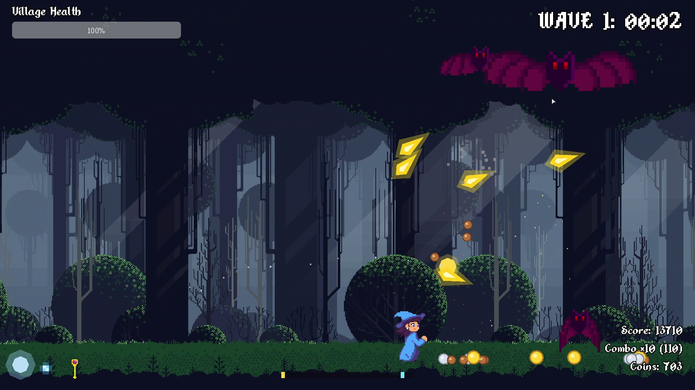
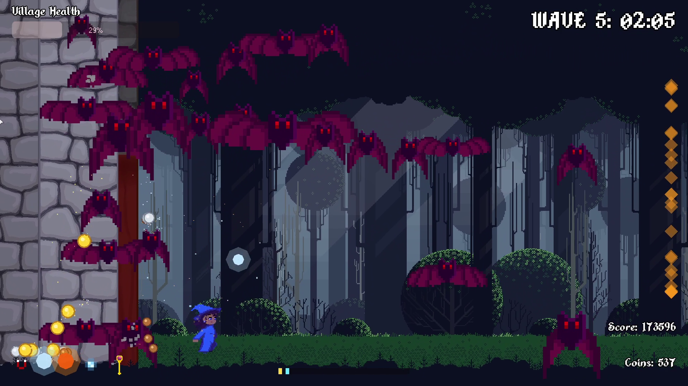
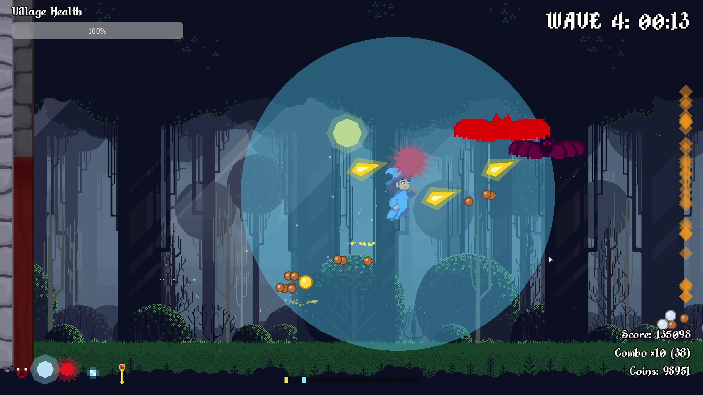

  

## 📖 About the Game

*"The village's survival relies on the resistance of a single gate. Every enemy impact brings the invasion closer, but striking down the hordes from the air turns the tide: their loot provides the vital energy needed to awaken devastating spells and reinforce your defenses. Mastering the battlefield and exterminating the threat before it breaches the village gate separates those who succumb to the darkness from those who survive to shatter their own records."*

Welcome to **Morgana, a Égide**! Take control of Morgana, an agile defensive mage, in a frantic battle to protect her village from the night creatures emerging from the dark forest.

## 📸 Screenshots

  
  
  

## 🎮 Controls

Movement is fluid and combat rewards precision.

*   **A / D** or **Arrows**: Move sideways.
*   **Space / W / Up Arrow**: Jump. Morgana features a **Quadruple Jump**! Each consecutive jump is slightly weaker, allowing you to hover in the air and create cadenced aerial tactics.
*   **Mouse**: Aim cursor. Your Magic Shots will always fire directly towards the cursor's position!
*   **Left Mouse Button**: Magic Shot (Hold to fire continuously in the direction of your mouse).
*   **Right Mouse Button**: Aura Attack (360º AoE blast to clear nearby enemies - watch out for the Cooldown!).
*   **P / ESC**: Pause Game.

---

## ⚔️ How to Play

Your mission is to **survive 5 Waves** of increasing difficulty and prevent the horde from destroying the village's west gate.

### 🛡️ Defend the Gate
Do not let the bats slip past the left side of the screen! The village health starts at 100%. Every enemy that escapes deals direct damage and shakes the structures. If the village integrity hits 0%, it's **Game Over**.

### 💎 Vital Energy & Kill Chain
Defeating enemies generates Vital Energy (currency) and increases your Combo Multiplier. Your combo doesn't just increase your score—it directly affects the power of some of your magic in real-time! Keep the chain going by taking out enemies quickly.

### 🛒 The Shop, Orbs & Evolution System
Between each frantic wave, the game enters a **Preparation Phase**. During this time of peace, you can access the Upgrade Shop to spend your accumulated **Vital Energy**. The shop is the core of Morgana's progression and offers three tiers of magical upgrades:

**1. Familiar Orbs (Base)**
You can acquire and equip up to three different autonomous magical orbs simultaneously. Each orb has a distinct combat style:
*   **Combo Orb:** Fires homing projectiles that become exponentially faster and stronger as your Combo Multiplier increases.
*   **Blade Orb:** A melee orb that rapidly orbits Morgana, acting as a shield that slices any bat that gets too close.
*   **Explosive Orb:** Casts heavy fireballs that deal massive area-of-effect damage, excellent for crowd control.

**2. Orb Level Up (Evolution Scrolls)**
Once you own a specific Orb, its corresponding **Evolution Scroll** becomes available in the shop. Buying these scrolls permanently levels up the orb, increasing its base stats (such as damage, speed, size, and cooldown reduction) so it can keep up with the increasing difficulty of the waves.

**3. Ultimate Transformations (Mastery Scrolls)**
After fully leveling up an Orb, a final **Transformation Scroll** appears. This grants a massive, gameplay-altering effect to the familiar:
*   **Combo Orb Transformation:** The orb unleashes an *Omni-directional* attack, firing a barrage of projectiles in all directions at once on every attack.
*   **Blade Orb Transformation:** The blade grows significantly larger and detaches from Morgana, actively chasing down the nearest Purple Giant bat.
*   **Explosive Orb Transformation:** Turns the fireball into a *Magical Molotov*. The explosion leaves a burning area on the ground that deals continuous damage to enemies that fly through it.

**4. General Upgrades & Utility**
Besides the familiar orbs, you can also use your Vital Energy to:
*   **Heal the Gate:** Restore the village's structural integrity.
*   **Upgrade Core Magic:** Buy scrolls to increase the power of Morgana's primary Wand and Aura attacks.
*   **Coin Magnet:** Increase the radius at which you collect dropped Vital Energy, keeping you safer from the horde.

### 🦇 Know Your Enemies
*   **Common Bats:** Fast, furious, and will test your aerial mobility.
*   **Purple Giants:** Huge and deadly, but they act as "energy banks," dropping massive amounts of loot when defeated.

---

## 👥 Development Team

*   **Eduardo Alvarenga** — Game Design & Quality Assurance (QA)
*   **Giuliana Civardi** — Art Direction, Illustrations & Animation Sprites
*   **João Pedro Gonçalves** — Programming & Game Design
*   **Mateus Lacerda** — Programming, Game Design & Illustrations
*   **Rosane Oliveira** — Programming & Game Design
*   **Tálisson Leite** — Music Composition